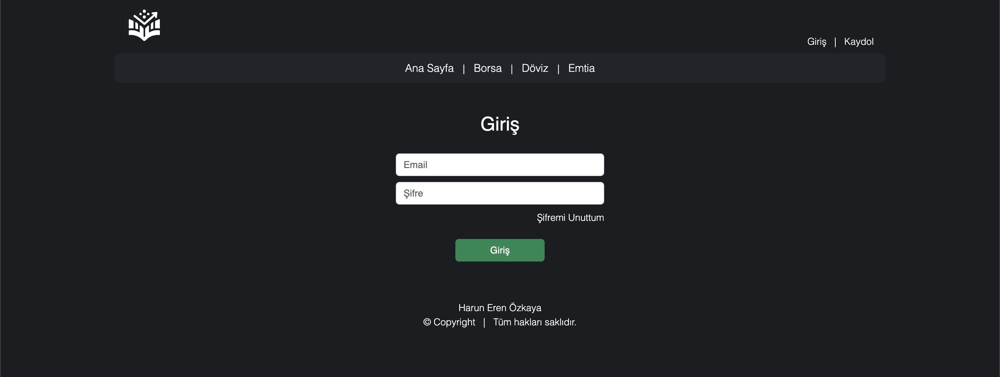
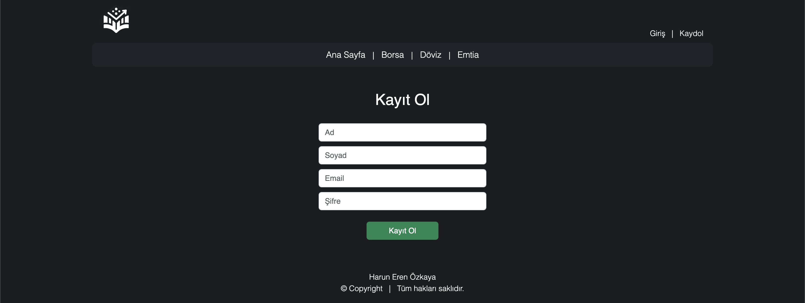

<h1 align="center"> Virtual Investment Platform</h1>   

 &nbsp;

<!-- START doctoc generated TOC please keep comment here to allow auto update -->
<!-- DON'T EDIT THIS SECTION, INSTEAD RE-RUN doctoc TO UPDATE -->

## Table of Contents

- [Table of Contents](#table-of-contents)
- [Introduction](#introduction)
- [Navigation](#navigation)
- [Screenshots](#screenshots)
- [System Requirements](#system-requirements)
- [Technologies](#technologies)
- [Contributors](#contributors)

<!-- END doctoc generated TOC please keep comment here to allow auto update -->

 

## Introduction

The Virtual Investment Platform is an easy-to-use and straightforward investment experience platform where individuals with no investment experience can gain experience with a virtual starting balance which allowing them to invest stocks , currencies and commodities.

 

## Navigation

Backend : 
Frontend : 
 

## Screenshots

* Login Page and Register Pages   
     &nbsp;
    

* Home Page   
     &nbsp;
    
* All Stocks - Currencies - Commodities Page   
    
    
    

* A Stock - Currency - Commodity Page   
    
    
    

* My Investment Page   
     &nbsp;

## System Requirements

- npm 9.8.1
- axios
- Spring Boot 3.2.1
- PostgreSQL 16
- Java 17

## Technologies

- Java
- Spring Boot
- Spring Security
- PostgreSQL
- Hibernate
- Javascript
- React.js
- Axios
