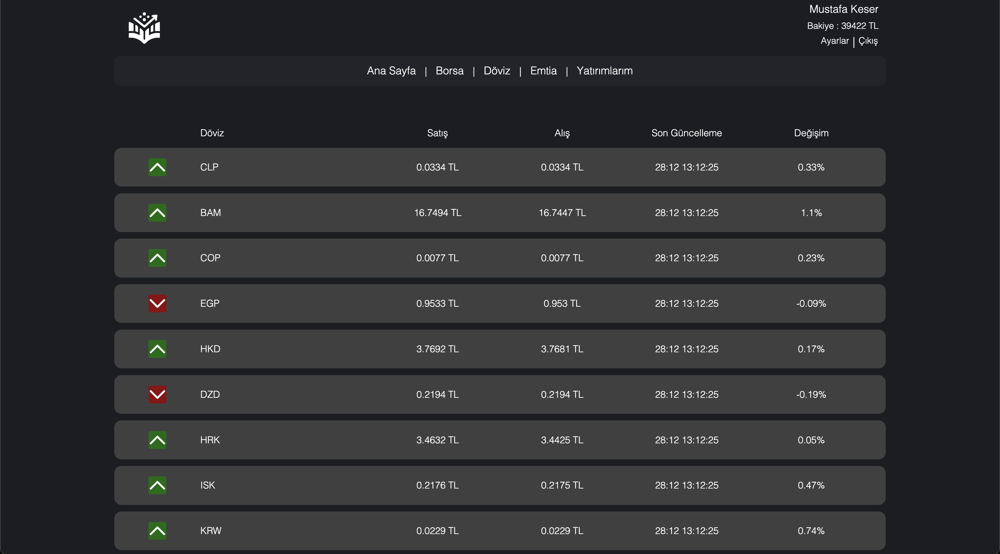
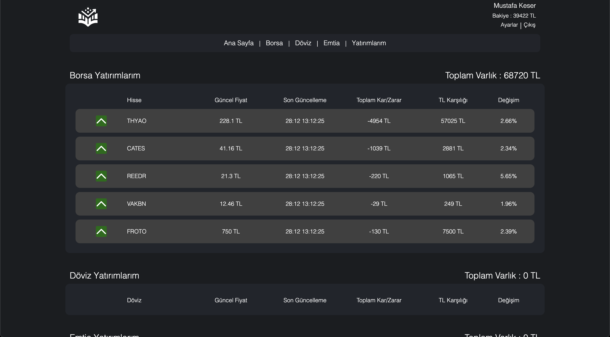

<h1 align="center"> Virtual Investment Platform</h1> <br> 
<p align="center">
 &nbsp;
</p>
<!-- START doctoc generated TOC please keep comment here to allow auto update -->
<!-- DON'T EDIT THIS SECTION, INSTEAD RE-RUN doctoc TO UPDATE -->

## Table of Contents

- [Table of Contents](#table-of-contents)
- [Introduction](#introduction)
- [Navigation](#navigation)
- [Screenshots](#screenshots)
- [Quick Start](#quick-start)
- [System Requirements](#system-requirements)
- [Technologies](#technologies)
- [Contributors](#contributors)

<!-- END doctoc generated TOC please keep comment here to allow auto update -->

<br>


## Introduction

The Virtual Investment Platform is an easy-to-use and straightforward investment experience platform where individuals with no investment experience can gain experience with a virtual starting balance which allowing them to invest stocks , currencies and commodities.

<br>

## Navigation

Backend : https://github.com/virtualInvestmentPlatform/backend <br/>
Frontend : this <br/>
<br>

## Screenshots

* Login Page and Register Pages <br><br>
     &nbsp;
    

* Home Page <br><br>
     &nbsp;
    
* All Stocks - Currencies - Commodities Page <br><br>
    
    
    

* A Stock - Currency - Commodity Page <br><br>
    
    
    

* My Investment Page <br><br>
     &nbsp;

## Quick Start

<p>For Backend : </p>

1. **Install Java 18**
   - Make sure Java 18 is installed on your system.

2. **Install PostgreSQL**
   - Install PostgreSQL and ensure it's running on your system.

3. **Database Configuration**
   - Configure your database settings in `resources/application.properties`. Replace the placeholders with your actual database details. For example:
     ```
     spring.datasource.url=jdbc:postgresql://YOUR_DATABASE_URL
     spring.datasource.username=YOUR_DATABASE_USERNAME
     spring.datasource.password=YOUR_DATABASE_PASSWORD
     ```

4. **API Key Configuration**
   - Create a file named `resources/keys.properties`.
   - Obtain an API key from [Collect API](https://collectapi.com/api/economy/altin-doviz-ve-borsa-api) and add it to the file:
     ```
     collectapi.apikey=YOUR_API_KEY
     ```

5. **Compile and Run the Application**
   - Depending on whether Maven is installed globally on your system, follow one of the two methods below:
     - **With Global Maven Installation:**
       In the directory of `pom.xml`, execute:
       ```
       mvn compile
       mvn exec:java -Dexec.mainClass="com.harun.virtualInvestmentPlatform.VirtualInvestmentPlatformApplication"
       ```
     - **Without Global Maven Installation:**
       In the directory of `pom.xml`, execute:
       ```
       ./mvnw compile
       ./mvnw exec:java -Dexec.mainClass="com.harun.virtualInvestmentPlatform.VirtualInvestmentPlatformApplication"
       ```

6. **Server Status**
   - After completing the above steps, the server should be running on `localhost:8080`.

<p>For Frontend : </p>

1. **Install Node.js and npm**
   - Make sure Node.js and npm are installed on your system.

2. **Install Dependencies**
    ```
       npm install
    ```
3. **Run Project**
     ```
     npm start
     ```
4. **Client Status**
   - After completing the above steps, the client should be running on `localhost:3000`.

## Additional Notes

- Ensure that your PostgreSQL server is running and accessible before starting the application.
- Check the Java version with `java -version` to confirm you're using Java 18.


## System Requirements

- npm 9.8.1
- axios
- Spring Boot 3.2.1
- PostgreSQL 16
- Java 17

## Technologies

- Java
- Spring Boot
- Spring Security
- PostgreSQL
- Hibernate
- Javascript
- React.js
- Axios
